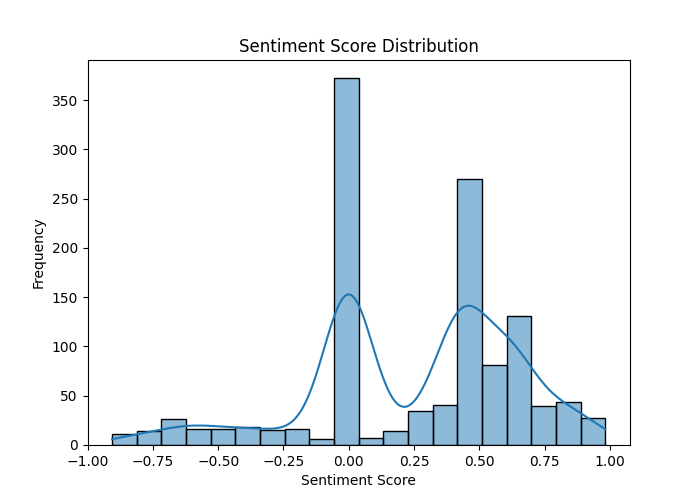

# Task 4: Insights and Recommendations

---

## 1. Introduction
This project analyzes Google Play Store reviews for three leading Ethiopian banking apps:

- **CBE Bank**
- **Bank of Abyssinia (BOA)**
- **Dashen Bank**

Using NLP preprocessing, sentiment analysis (VADER), keyword extraction, SQL queries, and visualizations, we uncover:

- Customer drivers (what they like)
- Pain points (what frustrates them)
- Differences between the banks
- Actionable recommendations

The dataset contains **1,200 cleaned reviews**, successfully loaded to PostgreSQL and analyzed.

---

## 2. Visualization Results

### **2.1 Rating Distribution**

**Interpretation:**
- **5-star reviews dominate (~740 reviews)** → Customers are generally happy.
- **1-star reviews are the second largest group (~260)** → Strong polarity: users either love or hate the apps.
- Very few 2–4 star reviews → Middle-ground feedback is rare.

---

### **2.2 Review Count per Bank**

**Interpretation:**
- Each bank has **roughly the same number of reviews (~400 each)**.
- This allows fair comparison across CBE, BOA, and Dashen.

---

### **2.3 Sentiment Category Counts**

**Interpretation:**
- **Positive reviews: ~700** → Majority of users express satisfaction.
- **Neutral reviews: ~370** → Many reviews contain short comments like “good” or “nice.”
- **Negative reviews: ~130** → Only a small subset of users report serious issues.

---

### **2.4 Sentiment Score Distribution**

**Interpretation:**
- Sentiment is skewed **strongly positive** (peak at >0.5 sentiment score).
- A small cluster exists around **negative scores (< -0.5)** → These correspond to complaints such as:
  - App crashes  
  - Slow performance  
  - Login issues  

---

## 3. Key Insights (Drivers & Pain Points)

### **Drivers (What Users Like)**
Across all banks:
- **Fast performance**
- **Easy money transfer**
- **Good interface / modern UI**
- **Convenience (no branch visits needed)**

CBE:
- Many mentions of **“easy to use”** and **“very fast”**

BOA:
- Users highlight **“best app”**, **“good experience”**

Dashen:
- Comments like **“nice app”, “works great”**

---

### **Pain Points (What Users Dislike)**

**CBE:**
- Frequent reports of **app crashes**
- **Login issues**
- **Network errors**

**BOA:**
- Complaints about **slow load time**
- Occasional **bugs** after updates

**Dashen Bank:**
- Issues with **OTP not arriving**
- Some **performance glitches**

---

## 4. Recommendations (Per Bank)

### **CBE**
✔ Improve app stability (most complaints)  
✔ Fix login/session timeout issues  
✔ Improve handling of poor internet connectivity  

---

### **BOA**
✔ Optimize loading speed  
✔ Fix bugs reported after new app updates  
✔ Improve UI clarity in navigation pages  

---

### **Dashen**
✔ Resolve OTP delivery failures  
✔ Improve backend response time  
✔ Add in-app support chat for user issues  

---

## 5. Ethics
- Reviews show a **positive skew**, meaning customers with good experiences post more often.
- Negative experiences may be under-represented.
- Automated sentiment models (VADER) may misinterpret non-English or mixed-language comments.

---

## 6. Conclusion
The reviews across all three Ethiopian banking apps are **mostly positive**, with clear strengths in convenience and functionality.  
However, addressing recurring technical issues (crashes, login failures, slow speeds, OTP problems) can significantly improve user satisfaction.

---

